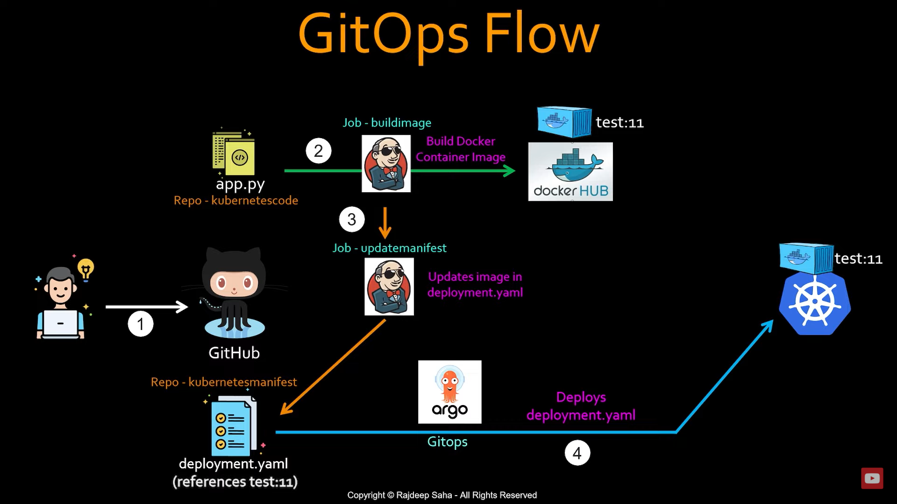

# CI_REPO



A **Jenkinsfile** is a script that defines a CI/CD pipeline in Jenkins using either **Declarative** or **Scripted** syntax. The main components of a Jenkinsfile are outlined below, focusing on the most commonly used **Declarative Pipeline** syntax.

---

### **1. `pipeline` Block**
The `pipeline` block is the root of a Declarative Pipeline and defines the entire structure of your CI/CD pipeline.

```groovy
pipeline {
    agent any
    stages {
        stage('Build') {
            steps {
                echo 'Building...'
            }
        }
    }
}
```

---

### **2. `agent`**
The `agent` block specifies where the pipeline or stage will run (e.g., a Jenkins node or a Docker container).

- **Options**:
  - `any`: Use any available agent.
  - `none`: No global agent; stages must define their agents.
  - Specify a label: Run on a specific Jenkins node with a matching label.
  - Use Docker:
    ```groovy
    agent {
        docker { image 'maven:3.6.3-jdk-11' }
    }
    ```

---

### **3. `stages`**
The `stages` block contains a series of sequential steps. Each stage represents a part of the pipeline.

```groovy
stages {
    stage('Build') {
        steps {
            echo 'Building...'
        }
    }
    stage('Test') {
        steps {
            echo 'Testing...'
        }
    }
    stage('Deploy') {
        steps {
            echo 'Deploying...'
        }
    }
}
```

---

### **4. `steps`**
The `steps` block inside a stage defines the actions to perform (e.g., running shell commands, invoking tools, etc.).

```groovy
steps {
    sh 'echo "Running shell commands..."'
    script {
        def message = 'Hello from the script block!'
        echo message
    }
}
```

---

### **5. `post`**
The `post` block defines actions to execute after the pipeline or a stage finishes, based on the pipeline result.

- **Options**:
  - `always`: Runs regardless of pipeline success or failure.
  - `success`: Runs only if the pipeline succeeds.
  - `failure`: Runs only if the pipeline fails.
  - `unstable`: Runs if the pipeline becomes unstable.

```groovy
post {
    always {
        echo 'Cleaning up...'
    }
    success {
        echo 'Pipeline succeeded!'
    }
    failure {
        echo 'Pipeline failed.'
    }
}
```

---

### **6. `environment`**
The `environment` block defines environment variables accessible to the pipeline.

```groovy
environment {
    BUILD_ENV = 'development'
    API_KEY = credentials('my-credentials-id')
}
```

---

### **7. `parameters`**
The `parameters` block defines input parameters for the pipeline.

```groovy
parameters {
    string(name: 'BRANCH', defaultValue: 'main', description: 'Branch to build')
    booleanParam(name: 'DEPLOY', defaultValue: true, description: 'Deploy after build')
}
```

---

### **8. `options`**
The `options` block defines execution settings for the pipeline.

```groovy
options {
    timeout(time: 30, unit: 'MINUTES')  // Timeout for the pipeline
    buildDiscarder(logRotator(numToKeepStr: '10'))  // Keep only the last 10 builds
}
```

---

### **9. `triggers`**
The `triggers` block defines automated triggers for the pipeline.

```groovy
triggers {
    cron('H 0 * * *')  // Run daily at midnight
    pollSCM('H/5 * * * *')  // Check SCM every 5 minutes
}
```

---

### **10. `tools`**
The `tools` block defines tool versions to use during the pipeline.

```groovy
tools {
    maven 'Maven 3.6.3'
    jdk 'JDK 11'
}
```

---

### **Example Jenkinsfile**
Here’s a complete example:

```groovy
pipeline {
    agent any
    environment {
        BUILD_ENV = 'production'
    }
    parameters {
        string(name: 'BRANCH', defaultValue: 'main', description: 'Branch to build')
    }
    stages {
        stage('Build') {
            steps {
                echo "Building branch: ${params.BRANCH}"
                sh 'mvn clean package'
            }
        }
        stage('Test') {
            steps {
                echo 'Running tests...'
                sh 'mvn test'
            }
        }
        stage('Deploy') {
            steps {
                echo 'Deploying...'
                sh './deploy.sh'
            }
        }
    }
    post {
        success {
            echo 'Pipeline completed successfully!'
        }
        failure {
            echo 'Pipeline failed!'
        }
    }
}
```

This structure ensures flexibility and modularity for CI/CD pipelines in Jenkins.

* Jenkins course: 
- https://www.youtube.com/watch?v=6YZvp2GwT0A&ab_channel=DevOpsJourney